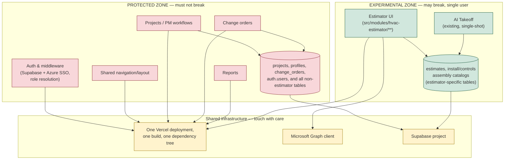
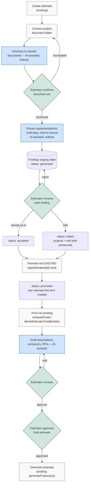
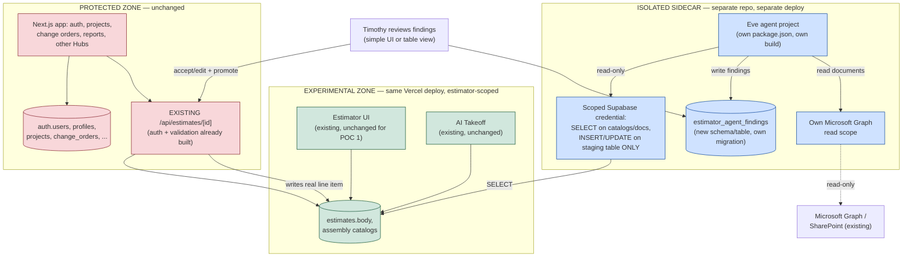
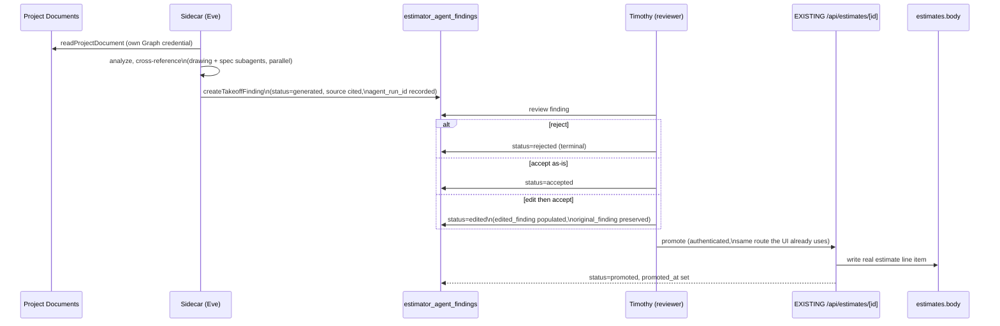

# Eve Agent Framework Evaluation for TCC ProjectHub Estimating

**Scope:** Architecture, workflow, and feasibility assessment only. No production code was modified, no dependencies were installed, and no secrets are reproduced in this document. All repository claims are cited to specific files; all Eve claims are cited to Vercel/Eve official sources or an independent third-party review, and are explicitly separated from marketing language.

**Assessed:** July 2026. Eve version referenced: v0.24.3 (beta).

**Revision note:** This version reflects a clarified operating context — Timothy Collins is currently the sole user of the estimator module, while the rest of ProjectHub (auth, projects, change orders, reports, other Hubs) is live and must not be disrupted. The recommendation, risk posture, testing scope, approval workflow, and success criteria below are revised accordingly. The repository architecture findings (Sections 4–10) are unchanged factual research and remain accurate regardless of this operating-context clarification.

---

## 1. Executive Summary

TCC ProjectHub already contains a working, single-shot AI feature — the HVAC Estimator's "AI Takeoff" scope parser — that turns pasted or uploaded scope text into estimate line items via a hand-tuned prompt, a real multi-provider LLM call, Zod-schema validation, and a deterministic assembly-catalog resolver. It is genuinely functional, not a stub. Beyond that one feature, the repository has **zero agentic infrastructure**: no MCP, no tool-calling loop, no multi-step orchestration, and no automated tests of any kind anywhere in the codebase.

Eve is a real, actively developed, Apache-2.0-licensed open-source framework from Vercel that directly targets the capability this project is missing: durable, multi-step, tool-using agent sessions with first-class human-approval checkpoints, subagent delegation, and native MCP support. It is currently in **public beta** (v0.24.3, released roughly one month before this assessment), and an independent reviewer explicitly warns to "pin your versions with care and pilot before you commit" after hitting silent webhook failures and mid-session breakage from pre-release dependency versions.

Given the clarified operating context — one user, estimator module explicitly experimental and tolerant of breakage, rest of ProjectHub must stay untouched — the correct posture is not cautious multi-user production hardening. It is: **move fast inside a hard boundary.** The estimator's zero test coverage and the framework's beta status are real facts, but they are risks *to the estimator experiment itself*, not to the live application, as long as the experiment is structurally incapable of touching protected-zone code, data, or the shared build/deploy pipeline. The rest of this document is organized around making that boundary real, not around slowing the experiment down.

## 2. Recommendation: **Pilot, via an isolated sidecar, moving fast inside the estimator boundary**

Build the Eve proof of concept as a **separate service/repository** (Option 2, Section 11.1) rather than adding Eve's dependency tree and build step directly into the existing Next.js/Vercel deployment (Option 1). This is the deciding safeguard for the protected zone: Eve compiles to its own runtime with its own build (`eve build && eve start`), not a lightweight library import, so embedding it inside ProjectHub's single Vercel deployment risks the shared build and dependency tree exactly where the user has said risk is unacceptable. A sidecar gets 100% of Eve's real capability (durable sessions, approval gates, subagents, MCP) with zero exposure of the protected zone to Eve's beta instability.

Inside that sidecar, however, there is no reason to be cautious. Prototype directly with Eve rather than first hand-rolling the same workflow with plain LLM calls — the whole point of testing Eve is to learn whether it's worth using, and a single-user, break-tolerant estimator experiment is exactly the low-stakes environment to learn that in quickly.

## 3. Confidence Level

**Moderate-high** on the repository findings (all traced file-to-file, cited below). **Moderate** on the Eve assessment (Section 10), sourced from Vercel's official documentation, the Eve GitHub repository, and one independent third-party review — the framework is one month old, so independent production track record beyond Vercel's own dogfooding claims is limited. **High** on the sidecar-vs-embedded recommendation specifically: it follows directly from how Eve's own documentation describes its build/deploy model (a compiled, separately-run app), not from speculation.

---

## 4. Repository Architecture Summary

**Framework/runtime:** Next.js 16.2.1, App Router only, React 19.0.0, TypeScript 5 (`strict: true`), Tailwind CSS. No Docker, no CI configuration, no test framework in `package.json`.

**Application shape:** One Next.js app, multiple business modules under `src/app/`:

| Module | Purpose |
|---|---|
| `crm/` | Sales CRM — accounts, contacts, opportunities, activities, tasks |
| `quotes/` (Pursuits) | Bid pipeline, quote import (incl. mass import + review), reconciliation |
| `estimating/` | The HVAC/controls estimator (wraps `src/modules/hvac-estimator/**`) |
| `pm/` (ProjectHub) | Project-manager workspace — BOM, change orders, weekly updates |
| `time` / `time-hub/` | Time tracking, QuickBooks Time sync |
| `billing/`, `ops/`, `admin/` | Billing, operations, and admin hubs |
| `installer/`, `customer/` | Role-scoped portals |

**Auth:** Supabase Auth. Microsoft SSO (Azure AD OAuth) for `@controlsco.net` addresses, email/password otherwise (`src/app/login/page.tsx`). Role resolution is centralized in `src/lib/auth/resolve-user-role.ts`; roles are `admin | pm | lead | installer | ops_manager | customer` (`src/types/database.ts`), with route-level enforcement in `src/lib/supabase/middleware.ts`. **This is protected-zone infrastructure — see Section 15.**

**Multi-tenancy:** Real and in progress — a documented "Trim+Respond" SaaS pivot (`codex/roadmap-trimrespond-saas-pivot.md`, `docs/saas-module-platform-architecture.md`). Subdomain-based org resolution (`src/lib/tenant/context.ts`) injects `x-org-id` per request. The project's own roadmap doc states organization-scoped RLS is implemented for `estimates` only. Not a blocker for a single-org, single-user estimator experiment, but a reason to keep the sidecar's database credential scoped narrowly rather than assuming org isolation is airtight everywhere.

**Deployment:** Vercel-native, no Docker. Two Vercel Cron jobs total (`vercel.json`): a nightly QuickBooks Time sync and a nightly demo-org data reset. No queue system.

**Security boundaries:** Row Level Security exists but is inconsistently applied — 26 of 79 migration files touch RLS policies, and org-scoping is complete only for `estimates`. 56 of 117 API route files instantiate a Supabase **service-role** client directly, bypassing RLS. No rate limiting exists anywhere. **The existing broad service-role key already used across 56 routes should not be reused by the sidecar — see Section 15.**

**Testing:** None. Zero `*.test.ts`, `*.spec.ts`, `__tests__` directories, or test-framework dependencies anywhere in the repository. **Per the revised scope (Section 17), this is not a prerequisite to fix before experimenting — it is a reason to add a small, targeted protection check around the boundary, not broad coverage.**

**Data model:** `estimates` table stores `id`, `organization_id`, `status`, `total_amount`, `gross_margin_amount`, `gross_margin_pct` as real columns, but **all line-item/equipment data lives inside a single `body JSONB` column** — no relational `estimate_line_items` table. Material/labor catalogs (`install_assembly_catalog`, `controls_assembly_catalog`) have **no `quote_date`, `cost_source`, `price_freshness`, or `confidence` columns**. All of these tables are **experimental-zone** (Section 15) — they are estimator-domain data, safe to extend or temporarily destabilize.

**Audit trail:** Minimal. The only genuine append-only log, `user_activity_events`, is scoped to authentication events only. No change-history exists for estimates or pricing.

**Existing AI/LLM integration:** Exactly one feature — the HVAC Estimator's "AI Takeoff" scope parser (Section 6). No Vercel AI SDK, no official provider SDKs; raw `fetch()` against OpenAI/Anthropic/Gemini/xAI/Azure OpenAI. No MCP anywhere. No agent framework, tool-calling loop, or multi-step orchestration anywhere.

**Document integration:** A mature, non-AI SharePoint/OneDrive layer via Microsoft Graph (`src/lib/graph/client.ts`, 764 lines, used across ~35 files). Reused by the AI Takeoff pipeline for large-file staging, otherwise deterministic.

### Diagram — Current Application Architecture, with Risk Zones



---

## 5. Current-State Estimating Workflow

*(Unchanged from prior research — reproduced for completeness.)*

```text
Create estimate (blank, or via AI Takeoff scope paste/upload)
  → build equipment line items (Quick Add picker / Guided Wizard decision trees / AI Takeoff import)
  → configure each item's controls selections against the assembly catalog
  → set project-level rate/markup settings (overhead, profit, bond, mileage, labor adjustments)
  → review estimate health (40/40/20 install/controls sanity check) and flagged issues
  → set Bid Version (Install Only vs. Turnkey) — determines whether controls cost enters totals at all
  → author Proposal Details (scope name, customer contact, brief/detailed narrative) and supporting documents
  → optionally create Bid Alternates (add/deduct scope priced separately)
  → generate internal report and/or customer-facing proposal export
  → save — total_amount/gross_margin persisted to the estimates row
```

All stages above are estimator-domain (`estimates` table + `src/modules/hvac-estimator/**`) — entirely inside the **experimental zone**.

### Diagram — Current Estimating Workflow

```mermaid
flowchart LR
    A["Create estimate"] --> B{"Populate scope"}
    B -->|manual| B1["Quick Add /\nGuided Wizard"]
    B -->|AI-assisted| B2["AI Takeoff:\npaste/upload scope text\n→ single LLM call\n→ Zod validation\n→ assembly resolver"]
    B1 --> C["body.items[] (JSONB)"]
    B2 --> C
    C --> D["Configure controls\nselections per item"]
    D --> E["Set rates/markups\n+ Bid Version"]
    E --> F["Computed totals\n(deriveEstimatorCostBuckets)"]
    F --> G["Review tab:\n40/40/20 health check"]
    G --> H["Proposal Details\n(free-text scope/assumptions)"]
    H --> I{"Bid Alternates?"}
    I -->|yes| I1["Separate priced scope"]
    I -->|no| J["Generate proposal /\ninternal report"]
    I1 --> J
    J --> K["Save →\ntotal_amount/gross_margin\npersisted, body overwritten\n(no version history)"]

    classDef gap fill:#fff3cd,stroke:#d39e00
    class G,H,K gap
```



Every node above is entirely inside the estimator module (`estimates` table + `src/modules/hvac-estimator/**`) — the whole diagram sits in the **experimental zone**.

---

## 6. Current Strengths

1. **The AI Takeoff pipeline is real, not a demo.** Per-organization encrypted multi-provider credentials, real OCR/document extraction, a mature hand-tuned domain prompt, Zod schema validation, and a deterministic assembly-catalog resolver.
2. **The pricing engine is sound and scope-aware** (`computeCosts`/`deriveEstimatorCostBuckets`).
3. **Document infrastructure (SharePoint/Graph) is mature.**
4. **An existing "staged extraction + review" precedent** already exists in the Opportunity Hub (`opportunity_extraction_reviews`).
5. **Everything estimator-domain is already cleanly separated by module and table**, which is exactly what makes the two-zone strategy in this revision practical rather than theoretical — the estimator was already largely isolated before this evaluation began.

## 7. Current Gaps and Technical Debt

1. **Zero automated tests anywhere in the repository.** For the protected zone, this means any change touching shared code needs a manual verification pass (Section 16.1) since there is no regression suite to lean on. For the experimental zone, this is simply accepted risk per the revised scope — not a blocker.
2. **No structured line-item storage** — all estimate data lives in a single JSONB blob. Experimental-zone concern only.
3. **No price freshness, cost source, or confidence tracking** in the material/labor catalogs. Experimental-zone concern.
4. **No real audit/version history for estimates or pricing.** Directly relevant to the simplified single-user approval model (Section 15.2) — the finding-state history *is* the audit trail for POC 1, since nothing else exists to lean on.
5. **RLS and service-role usage are inconsistent** — nearly half of API routes bypass RLS. This is the concrete reason the sidecar must mint its own narrowly-scoped credential rather than reuse the existing broad service-role key (Section 15.1).
6. **AI Takeoff is single-shot, not iterative.** The actual capability gap this evaluation is about.
7. **The assembly-training feedback UI stores corrections in `localStorage`** with no confirmed automatic feedback loop — flagged as needing verification, not confirmed broken.
8. **No rate limiting anywhere.** Worth a basic budget alert on the sidecar's model spend even for a single-user POC (cheap, prevents an unattended runaway loop from generating a surprise bill).

---

## 8. Optimized Future Workflow

*(Revised to use the simplified single-user approval vocabulary from Section 15.2.)*

```text
Create estimate (existing)
  → connect project document folder (SharePoint — infrastructure exists)
  → inventory and classify documents — NEW, AI-assisted, sidecar
  → estimator confirms document set is complete — HUMAN GATE (single user: Timothy)
  → extract equipment inventory + point counts from drawings/specs — NEW, AI-assisted, multi-step, sidecar
  → write findings to a staging table with source citations — NEW (status: generated)
  → estimator reviews each finding: accept / edit / reject — HUMAN GATE
  → approved (accepted or edited) findings promoted into a real estimate line item
    via the EXISTING /api/estimates/[id] route — status: promoted
  → cost/labor pricing applied via EXISTING computeCosts/deriveEstimatorCostBuckets — unchanged
  → agent drafts assumptions, exclusions, and RFIs from the same source citations — NEW, AI-assisted
  → estimator reviews/edits — HUMAN GATE
  → estimator approves final estimate — HUMAN GATE (existing status field: ready)
  → generate customer-facing proposal — EXISTING generateProposal.js, reused as-is
  → generated/accepted/edited/rejected/promoted history preserved per finding — NEW (Section 14)
```

### Diagram — Recommended Optimized Workflow



---

## 9. Agent versus Deterministic Software Boundaries

*(Unchanged — this classification does not depend on team size or deployment topology.)*

| Function | Category | Why |
|---|---|---|
| Reading project documents | Deterministic (tool) | Pure retrieval/I/O; SharePoint client already exists |
| Classifying documents | AI-assisted analysis | Requires content understanding |
| Extracting equipment schedules | AI-assisted analysis | Requires visual/structural understanding |
| Recognizing equipment | AI-assisted analysis | Pattern recognition |
| Counting repeated devices | AI-assisted analysis | Pair with deterministic recount where possible |
| Identifying controlled systems | AI-assisted analysis | Domain classification across sheets |
| Developing point lists | Agent-orchestrated workflow | Synthesizes multiple documents in one session |
| Selecting controller assemblies | AI-assisted analysis, constrained | Must resolve through existing deterministic `assemblyResolver.js` |
| Selecting exact part numbers | **Deterministic application logic** | Catalog lookup only, never LLM-generated |
| Looking up costs | **Deterministic application logic** | Direct table query |
| Applying labor units | **Deterministic application logic** | Direct table query |
| Comparing drawings with specifications | Agent-orchestrated workflow | Multi-document, iterative |
| Detecting conflicting quantities | Agent-orchestrated workflow | Same reasoning |
| Generating assumptions | AI-assisted analysis | Draft only, cites source, human-reviewed |
| Drafting RFIs | AI-assisted analysis | Draft only, human sends |
| Assigning confidence levels | AI-assisted analysis | Informational, prioritizes review, never bypasses it |
| Creating a BOM | **Deterministic application logic** | Assembled from *approved* findings + catalog lookups only |
| Calculating totals | **Deterministic application logic** | Already exists, unchanged |
| Applying overhead and profit | **Deterministic application logic** | Already exists, unchanged |
| Creating scenarios (bid alternates) | Human decision | Existing user-driven feature |
| Generating proposal scope narrative | AI-assisted analysis | Draft only, estimator edits before export |
| Updating vendor prices | Human decision, AI-assisted flagging | Only a human enters a new verified price |
| Sending quote requests | **Human decision** | External communication — never automated |
| Creating calendar reminders | **Deterministic application logic** | Simple scheduled notification |
| Producing final bid pricing | **Human decision** | The system must never silently finalize pricing |

---

## 10. Eve Capability Assessment

*(Unchanged — sourced from Vercel's official Eve docs, the `vercel/eve` GitHub repository, Vercel's launch blog, and one independent third-party review.)*

| Requirement | Assessment |
|---|---|
| Long-running document-review tasks | **Native Eve.** Sessions/turns model supports multi-step tool use within one durable session. |
| Durable execution / retries / state preservation | **Vercel platform (Vercel Workflows), exposed natively by Eve.** Self-hosted, a Postgres-backed "world" substitutes. |
| Human approval checkpoints | **Native Eve, well-documented.** A flag on a tool definition pauses the agent at zero compute cost until approved. |
| Structured outputs | **Native Eve** via typed tool `inputSchema`/Zod (matches this repo's existing pattern). |
| Tool permissions | **Native Eve, per-tool.** Each tool is its own file, independently scoped. |
| Subagent delegation | **Native Eve.** Fresh context, narrower tool set per subagent. |
| Sandboxed execution | **Vercel platform (Vercel Sandbox) by default; Docker/microsandbox/bash self-hosted.** |
| File handling / large PDFs / drawing packages | **Custom code likely required** — this repo's `unpdf`/`tesseract.js`/`mammoth` pipeline would be wrapped as tools, not replaced. |
| OCR / visual drawing analysis | **Model-dependent, not native to Eve.** |
| Parallel document review | **Native Eve**, via parallel subagents. |
| MCP support | **Native Eve.** Pre-built integrations (Slack, GitHub, Snowflake, Salesforce, Notion, Linear) are not estimating-specific — TCC's own tools still need building. |
| SharePoint / OneDrive integration | **Custom code required** — wrap `src/lib/graph/client.ts`. |
| Database integration | **Custom code required** — no native Supabase connector. |
| Background jobs / scheduled activity | **Native Eve** via `agent/schedules/*`. |
| Notifications | **Custom / channel-dependent.** |
| Auditability | **Partially native** (Agent Runs dashboard = operational observability, not the estimating-specific finding history in Section 14). |
| Observability / tracing | **Native (Vercel) or portable (OpenTelemetry export).** |
| Evaluation testing | **Native Eve** (`agent/evals/*`, `eve eval`) — a genuine built-in this codebase has no equivalent of. |
| Version control of instructions/skills | **Native**, plain files versioned with Git. |
| Multi-user operation | Native, but **not needed for POC 1** — deferred per Section 15.3. |
| Tenant and project isolation | **Custom code required**, but low-stakes for a single-org, single-user POC. |
| Security | **Shared responsibility** — Vercel Connect keeps secrets out of model context; scoping is still the implementer's job. |
| Cost control | **Consumption-based**, no flat fee — scales with session volume, tool calls, model usage. |
| Model portability | **Native, strong** — model strings resolve via AI Gateway or direct provider calls. |
| Vendor lock-in | **Real but bounded** — every Vercel-coupled piece has a documented portable swap, though self-hosting is not yet the polished first-class path. |
| Local development | **Native** — `npx eve@latest init` scaffolds a working dev server in under a minute. |
| Vercel deployment | **Native, first-class, easiest path.** |
| Non-Vercel deployment | **Supported but secondary** — `eve build && eve start` runs anywhere, loses the Agent Runs dashboard. |
| Framework maturity | **Beta, pre-1.0.** v0.24.3, released ~one month before this assessment. |
| Breaking-change risk | **Real, documented** by an independent reviewer (silent webhook failures, canary-dependency breakage). This is precisely the risk the sidecar isolation in Section 11.1 exists to contain. |

**What Eve does not provide, regardless of adoption:** the estimating-specific data model (Section 14), the SharePoint/Graph tool wrappers, catalog lookup tools, and the write/promotion logic.

---

## 11. Alternative Architecture Comparison

### 11.1 Deciding question for POC 1: Eve embedded in ProjectHub, or an isolated sidecar?

| | **Option 1 — Eve directly in the estimator experiment** | **Option 2 — Isolated sidecar** |
|---|---|---|
| What it means concretely | An `agent/` directory added inside (or built alongside, but deployed as part of) the existing `tcc-projecthub` Vercel project | A separate repository/service running its own Eve project, with its own `package.json`, build, and deploy — talking to Supabase and Microsoft Graph over the network, not sharing a process or dependency tree with ProjectHub |
| Speed to first result | Fast | Equally fast, or faster — `npx eve@latest init` in a clean directory has no existing Next.js/Tailwind/middleware conventions to reconcile with |
| Risk to shared build/deploy | **Real.** Eve is not a lightweight library import — it compiles its own runtime (`eve build && eve start`) with its own dependency tree (Vercel Workflows, Sandbox, AI Gateway client libraries, etc.). Adding that to the same `package.json`/deploy as auth, projects, and change orders means an Eve dependency conflict or build failure can break the protected zone's build, even if the agent's *logic* only touches estimator tables. | **None.** A build failure, dependency conflict, or runtime crash in the sidecar cannot affect ProjectHub's build or deploy, because they are not the same deployable. |
| Directness of testing durability/approval gates | Full — same process | **Also full.** Eve's session/durability/approval-gate model behaves identically whether the agent runtime is co-located with ProjectHub or reached over HTTP from it. Nothing about testing "does the approval gate actually pause and resume" requires being in the same repo. |
| Coupling to Vercel-specific services | Shares ProjectHub's existing Vercel project resources | Can use its own Vercel project (still gets Vercel Workflows/Sandbox/AI Gateway) or be self-hosted entirely separately — strictly more flexible |
| Effort to remove if the experiment fails | Requires surgically removing agent code from a shared deploy without breaking anything else — harder to do with confidence given zero test coverage | **Delete the repository / stop the service.** Rollback is trivial and provably complete. |
| Database access model | Naturally tempts reusing the app's existing broad service-role credential (already used by 56/117 routes) since it's "already right there" | Forces a deliberate, narrowly-scoped credential decision (Section 15.1) — the isolation is structural, not just intentional |
| Extra plumbing required | Less — no new auth/deploy surface | More — a second deploy target, its own env vars, and (for promotion) an authenticated call back into ProjectHub's existing `/api/estimates/[id]` route |

**Recommendation: Option 2, isolated sidecar**, exactly per the user's own stated bias — "favor an isolated sidecar if adding Eve dependencies to the existing ProjectHub application could affect the live build, deployment, or shared runtime." It does: Eve's own documentation describes it as a separately-built, separately-run application, not an importable library. The extra plumbing Option 2 requires is small (one authenticated HTTP call for promotion, one scoped database credential) and is worth paying to get a rollback path that is trivially complete rather than "should be fine if I'm careful."

### 11.2 Full option comparison

| Option | Dev effort | Ops complexity | Reliability | Maintainability | Flexibility | Auditability | Vendor lock-in | Fit given single-user/dual-zone context |
|---|---|---|---|---|---|---|---|---|
| **A — Keep current architecture, targeted AI calls + conventional jobs** | Low-moderate | Low | High for single-shot; cannot do multi-step review | High | Low for iterative work | Custom, same as any option | None | Safe fallback if the sidecar pilot fails |
| **B — Eve as sidecar behind the existing app/DB (= Option 2 above)** | Moderate | Moderate (second deploy) | Framework young; isolation contains the blast radius | Moderate | High — subagents, MCP, approval gates | Finding-state history is the audit trail (Section 14) | Real but bounded, and fully swappable since it's isolated | **Recommended for POC 1** |
| **C — Eve-centered redesign of the whole estimator** | Very high | High | Unproven at this scale | Low near-term | High in theory | No inherent gain over B | Highest | Not warranted — no need to rebuild a working system to run a POC |
| **D — MCP-centered architecture** (estimating functions as MCP servers) | Moderate | Low-moderate | High | High | Highest long-term reuse | Same custom need | Lowest — open standard | Worth doing as groundwork regardless of the Eve decision |
| **E — Custom workflow engine** (TS services + queue + state machine) | High | Moderate-high | High once built | Moderate | Moderate | Custom | None | Legitimate fallback if Eve disappoints |

Option D remains worth building either way: the sidecar's own tools (`getApprovedAssembly`, `getLaborStandard`, `getCurrentMaterialCost`) can be written as MCP servers from day one, which costs nothing extra and means they're reusable from Eve, Claude Code, or any other client if the framework decision changes later.

---

## 12. Recommended Target Architecture



**The key structural safeguard:** the sidecar's database credential can `SELECT` from catalogs/documents and `INSERT`/`UPDATE` only its own staging table. It has **no write grant on `estimates` at all.** Promotion — turning an accepted/edited finding into a real estimate line item — happens by calling the **existing, already-authenticated** `PUT /api/estimates/[id]` route, the same one the current UI already uses to save estimates. This means the write path to real estimate data goes through code that already exists, is already authorized, and was not written for this experiment — the sidecar cannot corrupt `estimates.body` through some agent-specific write path because there isn't one.

---

## 13. Proposed Eve Structure (sidecar, POC 1 scope)

Lives in its **own repository** (e.g. `tcc-estimator-agent`), not nested inside `tcc-projecthub`.

```text
tcc-estimator-agent/                # separate repo, separate deploy
├── agent.ts                        # model config
├── instructions.md                 # "You inventory and cross-check controls scope
│                                   #  from project documents. You never write to
│                                   #  ProjectHub's estimates table directly. Every
│                                   #  finding must cite a source document, sheet,
│                                   #  and excerpt."
├── tools/
│   ├── listProjectDocuments.ts     # read-only, own Graph credential
│   ├── readProjectDocument.ts      # read-only
│   ├── searchProjectDocuments.ts   # read-only
│   ├── getApprovedAssembly.ts      # read-only, scoped Supabase credential
│   ├── getLaborStandard.ts         # read-only
│   ├── getCurrentMaterialCost.ts   # read-only
│   └── createTakeoffFinding.ts     # WRITE, but ONLY to estimator_agent_findings
├── skills/
│   ├── controls-drawing-review.md
│   ├── vav-controls-takeoff.md
│   ├── ahu-controls-takeoff.md
│   ├── chilled-water-plant-takeoff.md
│   ├── niagara-jace-replacement-estimating.md
│   ├── point-list-development.md
│   └── rfi-development.md
├── subagents/
│   ├── drawing-reviewer/
│   ├── specification-reviewer/
│   └── scope-auditor/
├── .env                            # OWN credentials — see Section 15.1, never shared with ProjectHub's env
└── evals/
    └── benchmark-project.eval.ts   # Section 16 scoring harness
```

For POC 1 specifically, the review step does not need a polished UI. A plain internal page (in the sidecar itself, or a minimal read/write table view) that Timothy uses directly to accept/edit/reject and trigger promotion is sufficient — building a ProjectHub-integrated review panel is a Phase 2 concern (Section 17), not a POC 1 requirement, per "the proof of concept does not need enterprise-grade multi-user workflow design at this stage."

Subagent reasoning (unchanged from prior analysis, still applies): Material/labor lookups stay plain tools (deterministic, no benefit from a separate identity). Drawing Reviewer and Specification Reviewer are subagents because they benefit from long, isolated context per document set and can run in parallel. Scope Auditor is a subagent because it needs a fresh, unanchored context to review the primary agent's own conclusions adversarially.

---

## 14. Data and Traceability Design

Single new table, `estimator_agent_findings`, living in the sidecar's own migration (Section 17), additive-only, no touch to any existing table:

| Column | Purpose |
|---|---|
| `id` | PK |
| `project_id`, `estimate_id` | Links to existing entities (read-only references, no FK-enforced coupling required for POC 1) |
| `source_document_id`, `source_revision`, `sheet_or_page`, `source_excerpt` | Traceability |
| `finding_type` | equipment / point / scope_gap / conflict / assumption / rfi |
| `equipment_tag`, `quantity`, `proposed_assembly` | The proposed data — `proposed_assembly` references the *existing* catalog by ID, never free text |
| `confidence` | Agent self-report, informational |
| `original_finding` | Immutable snapshot of exactly what the agent generated |
| `edited_finding` | Present only if Timothy modified it before accepting — preserves what changed |
| `status` | **`generated \| accepted \| edited \| rejected \| promoted`** (exact vocabulary requested) |
| `reviewed_at`, `promoted_at` | Timestamps — reviewer identity is implicitly Timothy for POC 1, a `reviewer_id` column can exist but isn't enforced against a role matrix |
| `agent_run_id`, `model`, `model_version`, `skill_version` | Full provenance of which run/model/skill produced the finding |

**State transitions:** `generated` → (`accepted` | `edited` | `rejected`). `accepted` or `edited` → `promoted` (triggers the existing `/api/estimates/[id]` write, Section 12). `rejected` and `promoted` are terminal. This preserves exactly what was asked: what the AI generated (`original_finding`, immutable), what was changed (`edited_finding`), what was accepted/rejected (`status` + timestamp), the source (`source_document_id`/`sheet_or_page`/`source_excerpt`), and when it was promoted (`promoted_at`).

No approver matrix, no multi-signoff, no segregation-of-duties logic — deferred per Section 15.3, since Timothy is the only reviewer.

### Diagram — AI Output Approval and Promotion Flow



---

## 15. Security and Approval Model

### 15.1 Safeguards required to protect ProjectHub (non-negotiable)

- **The sidecar is a separate deployable** (Section 11.1) — a build or dependency failure in it cannot break ProjectHub's build.
- **The sidecar never uses ProjectHub's existing broad service-role key.** Mint a new, narrowly-scoped Postgres credential (or Supabase RLS policy set) that grants `SELECT` on read-needed tables (catalogs, document metadata) and `INSERT`/`UPDATE` on `estimator_agent_findings` only — nothing else. No grant on `projects`, `profiles`, `change_orders`, `auth.*`, or any table outside the estimator domain.
- **The sidecar never writes to `estimates` directly.** Promotion goes through the existing authenticated `/api/estimates/[id]` route (Section 12) — the only "write path" the sidecar has to real estimate data is a route that already existed, was already authorized, and enforces its own validation.
- **No changes to shared authentication.** The sidecar authenticates to ProjectHub's API as Timothy (an existing admin session/token), not by touching the auth system itself.
- **Environment-variable isolation.** The sidecar's `.env` is entirely separate from ProjectHub's `.env.local` — no shared secrets, no risk of the sidecar's config drift affecting ProjectHub's Vercel project.
- **Database migrations for the experiment are additive-only** — one new table (or a whole new schema, e.g. `agent.*`, for even cleaner rollback via `DROP SCHEMA agent CASCADE`). No `ALTER`/`DROP` on any existing table, ever, without a separate, explicit, reviewed migration.
- **A dedicated feature branch** (e.g. `experiment/eve-estimator-agent`) for any ProjectHub-side change (even the small promotion-call wiring), merged to `main` only after the protection checks in Section 16.1 pass. `main` auto-deploys to the live site, so nothing experimental lands there by accident.

### 15.2 Safeguards required for trustworthy estimates (matters regardless of team size)

- **Every finding preserves its full provenance** (Section 14) — this is what makes the estimator trustworthy even with an informal single-user review process, because nothing is silently converted into a bid number without a citation trail.
- **The agent never has direct write access to `estimates`.** This is not a multi-user control — it's the mechanism that guarantees "the system must not silently convert uncertain document interpretations into final pricing," which holds even with exactly one reviewer.
- **Confidence scores are informational only**, never a gate that bypasses review.

### 15.3 Features explicitly deferred because Timothy is currently the only estimator

- Multi-approver workflows, role matrices, or segregation of duties.
- A polished, ProjectHub-integrated review UI — a plain table/internal page is sufficient for POC 1.
- Multi-tenant-safe agent tooling — the sidecar can assume a single organization for now.
- Formal SOC2-style audit logging beyond the finding-state history in Section 14.
- Production-grade workload scaling, concurrency handling, or rate limiting beyond a basic cost alert.
- Full ProjectHub test coverage (Section 16.1 asks for targeted protection checks, not broad coverage).

---

## 16. Proof-of-Concept Plan

### 16.1 Mandatory protection tests (protected zone — required before any merge to `main`)

Not broad ProjectHub test coverage — targeted verification that the experiment cannot have touched the protected zone:

- `npm run build` succeeds on the feature branch with no new errors.
- Manual smoke check: login (both Microsoft SSO and email/password paths), main navigation, `/pm` project access, change-order access, and at least one report page all load without error, for the admin role.
- Diff review of any new Supabase migration confirms it is additive-only (new table/schema, no `ALTER`/`DROP` on an existing table).
- Confirm the sidecar's database credential genuinely cannot write to `estimates` or read protected-zone tables — attempt an out-of-scope query against it and confirm it is rejected.
- Confirm environment variables are not shared between the sidecar and ProjectHub's Vercel project.

### 16.2 Estimator-focused tests (experimental zone — prioritized, not exhaustive)

- Estimate calculation regression (spot-check `computeCosts`/`deriveEstimatorCostBuckets` against known values).
- AI staging record creation and read.
- Source traceability field population (every finding actually has a resolvable sheet/page/excerpt).
- Finding-state transition correctness (no invalid transitions, e.g. `rejected` → `promoted`).
- Promotion correctly creates a real estimate line item via the existing API route.
- Duplicate/retried agent runs do not silently duplicate findings (dedup on `agent_run_id` + source + equipment tag).
- Agent tool permission boundaries hold under a deliberate out-of-scope attempt (see 16.1).
- Rollback/cleanup: confirm the experiment's data (staging table, sidecar deploy) can be fully removed with zero trace in the protected zone.

Temporary estimator UI instability during this work is acceptable. Any sign of corruption in a non-estimator table is not, and is a stop-and-fix event regardless of POC progress.

### 16.3 Success criteria — the six learning questions (primary rubric for POC 1)

1. **Can the agent accurately identify equipment and controlled systems from real bid documents?**
2. **Can it provide reliable sheet and page references?**
3. **Can it detect meaningful conflicts and missing scope?**
4. **Does Eve manage the multi-step workflow more effectively than ordinary application code would have?**
5. **Does the output save meaningful takeoff time?**
6. **Is the framework stable enough to keep using?**

These are the actual go/no-go questions (Section 20). The following measurements support answering them with evidence rather than impression, using one already-completed, awarded/archived estimate as a benchmark (documents only, completed takeoff hidden until scoring):

| Supporting metric | Answers which question |
|---|---|
| % equipment correctly identified (recall) / % false positives (precision) | Q1 |
| Quantity accuracy | Q1 |
| Source citation accuracy (does the cited sheet/excerpt actually support the finding) | Q2 — the single most important metric for ever trusting the tool |
| Number of missed vs. fabricated scope items | Q3 |
| RFI/conflict usefulness (Timothy-rated) | Q3 |
| Turns/tool-calls/subagent handoffs actually used vs. a hypothetical single-shot attempt | Q4 |
| Time spent reviewing findings vs. building the takeoff from scratch | Q5 |
| Breaking changes, silent failures, or version-pinning pain encountered during the POC | Q6 |

Do not use "the output looked good" as a criterion for any of the six.

---

## 17. Phased Implementation Roadmap

1. **Phase 0 — groundwork (either zone, low risk):** Mint the sidecar's scoped Supabase credential and Graph read scope. Write the `estimator_agent_findings` migration in its own schema. Stand up the sidecar repo with `npx eve@latest init`. None of this touches `main`.
2. **Phase 1 — POC 1 (sidecar only, feature branch if any ProjectHub-side wiring is needed):** Build the tools/skills/subagents in Section 13, run the Section 16 benchmark against one completed estimate, score against the six questions. The sidecar can read real project documents and the real (read-only) assembly catalogs from day one — no reason to wait, since it cannot write anywhere risky.
3. **Phase 2 — gated on Phase 1 answers to Q1–Q6:** If the six questions come back positive, build the promotion call from the sidecar's review step into `/api/estimates/[id]`, merge the small feature-branch changes (if any) to `main` after Section 16.1 passes, and start using it on a real, non-benchmark estimate.
4. **Phase 3:** Add drawing-vs-spec conflict detection and the scope-auditor subagent once the base extraction loop is trusted.
5. **Phase 4:** Only after sustained use, consider a proper ProjectHub-integrated review UI, multi-tenant-safe tooling, and any of the Section 15.3 deferred items — and only if a second estimator is actually imminent.

Do not schedule a "replace AI Takeoff" or "replace the estimator UI" phase — nothing in this evaluation supports that, and both keep working unmodified throughout.

## 18. Risks and Open Questions

- **Framework risk (contained, not eliminated):** Eve is pre-1.0; a breaking change could stall the sidecar. Because the sidecar is isolated, the *contained* consequence is "the POC needs rework," not "ProjectHub breaks."
- **Cost risk:** no LLM spend controls exist anywhere in this codebase; set a budget alert on the sidecar's model usage even for solo use.
- **Open question:** does the assembly-training feedback UI actually feed back into `assemblyResolver.js`? Affects whether match quality improves automatically over time — verify before Phase 2.
- **Open question:** actual document format mix (native CAD/PDF vs. scanned/rasterized) — materially affects the vision/OCR approach and wasn't determinable from the repository alone.
- **Residual risk even with isolation:** the promotion step (Section 12) does call back into ProjectHub's live API. This is deliberately the *only* touchpoint, and it reuses existing, already-hardened code rather than new agent-specific write logic — but it is still a real integration point and deserves the Section 16.1 checks before Phase 2, not just at POC 1 kickoff.

## 19. Specific Repository Files Likely to Need Modification

**In `tcc-projecthub` (this repo) — kept minimal by design:**
- None required for Phase 1 (POC 1) if the sidecar reads directly from Supabase/Graph and Timothy reviews findings outside ProjectHub's UI.
- If Phase 2 proceeds: a small, additive route or reuse of the existing `PUT /api/estimates/[id]` (no modification needed, just called from a new client), and optionally a new estimator-scoped review page under `src/app/estimating/[id]/agent-review/` — net-new, does not modify existing estimator files.
- Unaffected regardless of phase: `estimateCalc.js`, `projectSettings.js`, `AiTakeoffModal.jsx`, `generateProposal.js`, and everything in the protected zone.

**In the new `tcc-estimator-agent` repo:** everything in Section 13 — entirely new, entirely separate.

## 20. Final Go/No-Go Decision Criteria

**Go (proceed to Phase 2):** Q1–Q3 in Section 16.3 come back positive on the benchmark project (equipment identification and citations are trustworthy, conflicts/RFIs are genuinely useful), Q4–Q5 show Eve's orchestration is doing real work and saving real time versus building the takeoff by hand, and Q6 — no breaking change or instability that cost more time than the POC saved.

**No-Go (stop, fall back to Option A/D):** citation accuracy is unreliable, the false-positive rate would require re-verifying the whole drawing set anyway, Eve had a breaking change that outweighed the time saved, or the multi-step orchestration didn't meaningfully outperform what a single well-engineered prompt (like the existing AI Takeoff) could already do.

Either outcome, the protected zone was never at risk, because it was never in the sidecar's reach to begin with.

---

*This document does not constitute an endorsement of adopting any agent framework. It reflects the simplest architecture judged capable of learning, quickly and safely, whether Eve materially improves TCC's controls estimating workflow.*
