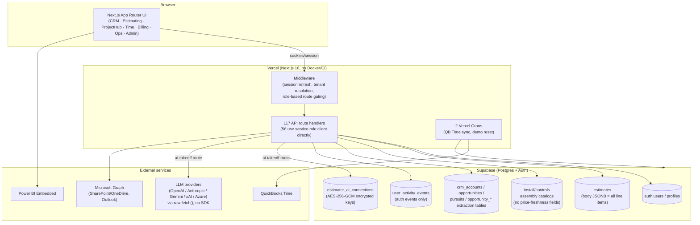
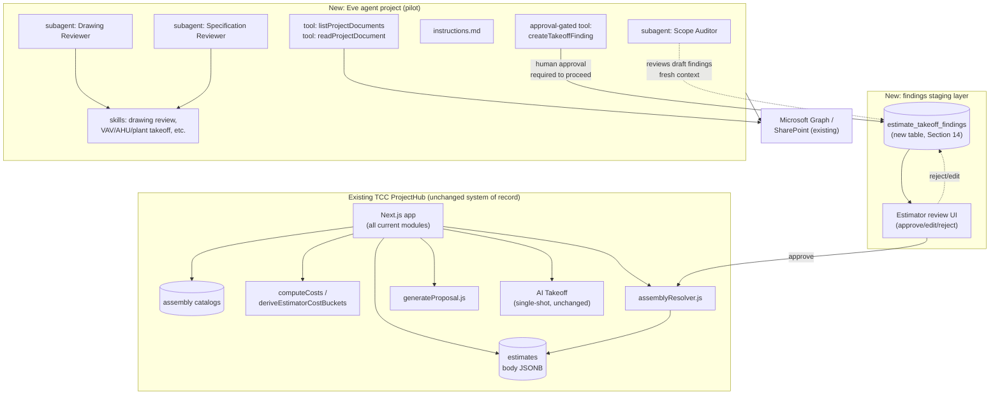
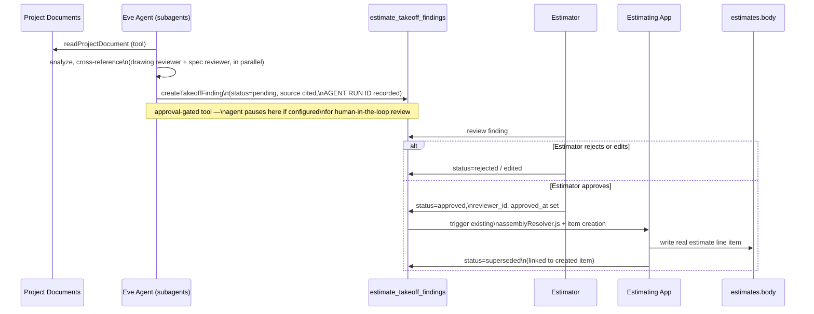

# Eve Agent Framework Evaluation for TCC ProjectHub Estimating

**Scope:** Architecture, workflow, and feasibility assessment only. No production code was modified, no dependencies were installed, and no secrets are reproduced in this document. All repository claims are cited to specific files; all Eve claims are cited to Vercel/Eve official sources or an independent third-party review, and are explicitly separated from marketing language.

**Assessed:** July 2026. Eve version referenced: v0.24.3 (beta).

---

## 1. Executive Summary

TCC ProjectHub already contains a working, single-shot AI feature — the HVAC Estimator's "AI Takeoff" scope parser — that turns pasted or uploaded scope text into estimate line items via a hand-tuned prompt, a real multi-provider LLM call, Zod-schema validation, and a deterministic assembly-catalog resolver. It is genuinely functional, not a stub. Beyond that one feature, the repository has **zero agentic infrastructure**: no MCP, no tool-calling loop, no multi-step orchestration, and no automated tests of any kind anywhere in the codebase.

Eve is a real, actively developed, Apache-2.0-licensed open-source framework from Vercel that directly targets the capability this project is missing: durable, multi-step, tool-using agent sessions with first-class human-approval checkpoints, subagent delegation, and native MCP support. Conceptually, it is a strong match for "read a drawing package, cross-check it against a spec, flag conflicts, draft RFIs, and pause for an estimator's sign-off before touching estimate data." That is a different capability tier than a single prompt-response call, and building it by hand would mean re-implementing durable execution, pause/resume, and approval gating from scratch.

However, Eve is in **public beta**, released roughly one month before this assessment, on a framework version below 1.0, with an independent reviewer explicitly warning to "pin your versions with care and pilot before you commit" after hitting silent webhook failures and mid-session breakage from pre-release dependency versions. TCC ProjectHub is a small-team, no-test-suite, revenue-critical estimating system for a business that cannot absorb framework churn the way Vercel's own engineering org can. Betting the estimating pipeline on pre-1.0 infrastructure now would be premature.

## 2. Recommendation: **Pilot**

Run one narrow, low-stakes, benchmarked proof of concept (Section 16) alongside the current application — not inside it, and never writing to approved estimate data. Do not adopt Eve as production infrastructure yet. Do not reject it either: no other option in Section 11 gives you durable multi-step document review with built-in approval gates for less total effort than Eve provides today, and the deterministic groundwork this pilot requires (an approved-assembly lookup tool, a labor-standard lookup tool, a findings-staging table) is valuable regardless of which orchestration layer eventually sits on top of it.

## 3. Confidence Level

**Moderate-high** on the repository findings (all traced file-to-file, cited below, cross-checked against my own direct reads of the estimator module from prior work in this codebase this session). **Moderate** on the Eve assessment: sourced from Vercel's own current documentation, the Eve GitHub repository, and one independent third-party review, but the framework is one month old, so there is limited independent production track record beyond Vercel's own dogfooding claims, which I treat with appropriate skepticism (Section 10).

---

## 4. Repository Architecture Summary

**Framework/runtime:** Next.js 16.2.1, App Router only, React 19.0.0, TypeScript 5 (`strict: true`), Tailwind CSS. No Docker, no CI configuration, no test framework in `package.json`.

**Application shape:** One Next.js app, multiple business modules under `src/app/`:

| Module | Purpose |
|---|---|
| `crm/` | Sales CRM — accounts, contacts, opportunities, activities, tasks |
| `quotes/` (Pursuits) | Bid pipeline, quote import (incl. mass import + review), reconciliation |
| `estimating/` | The HVAC/controls estimator (wraps `src/modules/hvac-estimator/**`) |
| `pm/` (ProjectHub) | Project-manager workspace — BOM, change orders, weekly updates |
| `time` / `time-hub/` | Time tracking, QuickBooks Time sync |
| `billing/`, `ops/`, `admin/` | Billing, operations, and admin hubs |
| `installer/`, `customer/` | Role-scoped portals |

**Auth:** Supabase Auth. Microsoft SSO (Azure AD OAuth) for `@controlsco.net` addresses, email/password otherwise (`src/app/login/page.tsx`). Role resolution is centralized in `src/lib/auth/resolve-user-role.ts`; roles are `admin | pm | lead | installer | ops_manager | customer` (`src/types/database.ts`), with route-level enforcement in `src/lib/supabase/middleware.ts`.

**Multi-tenancy:** Real and in progress — a documented "Trim+Respond" SaaS pivot (`codex/roadmap-trimrespond-saas-pivot.md`, `docs/saas-module-platform-architecture.md`). Subdomain-based org resolution (`src/lib/tenant/context.ts`) injects `x-org-id` per request. A second `OrganizationMemberRole` enum (`owner | admin | manager | member | customer`) layers on top of the legacy role system. The project's own roadmap doc states organization-scoped RLS is implemented for `estimates` only — "all other tables rely on role-based RLS only." This is a self-documented gap, not my inference.

**Deployment:** Vercel-native, no Docker. Two Vercel Cron jobs total (`vercel.json`): a nightly QuickBooks Time sync and a nightly demo-org data reset. No queue system (no BullMQ, Inngest, or similar).

**Security boundaries:** Row Level Security exists but is inconsistently applied — 26 of 79 migration files touch RLS policies, and per the app's own roadmap doc, org-scoping is complete only for `estimates`. 56 of 117 API route files instantiate a Supabase **service-role** client directly, bypassing RLS and relying on route-level authorization checks instead. No rate limiting exists anywhere in the codebase.

**Testing:** None. Zero `*.test.ts`, `*.spec.ts`, `__tests__` directories, or test-framework dependencies anywhere in the repository.

**Data model:** `estimates` table (`supabase/migrations/023_estimates.sql` + later extensions) stores `id`, `organization_id`, `status`, `total_amount`, `gross_margin_amount`, `gross_margin_pct` as real columns, but **all line-item/equipment data lives inside a single `body JSONB` column** — there is no relational `estimate_line_items` table. Material/labor catalogs (`install_assembly_catalog`, `controls_assembly_catalog`) store unit cost/hours, category, and part number/manufacturer, but have **no `quote_date`, `cost_source`, `price_freshness`, or `confidence` columns at all**.

**Audit trail:** Minimal. The only genuine append-only log in the system, `user_activity_events` (`051_user_activity_events.sql`), is scoped to authentication events only (login, password change, portal access). There is no change-history or version log for estimates, pricing, or project data — just `updated_at`/`created_by`/`modified_by` columns that overwrite on each change.

**Existing AI/LLM integration:** Exactly one feature — the HVAC Estimator's "AI Takeoff" scope parser (Section 6). No Vercel AI SDK, no official provider SDKs; all LLM calls are raw `fetch()` against OpenAI/Anthropic/Gemini/xAI/Azure OpenAI REST endpoints. No MCP anywhere in the repository. No agent framework, tool-calling loop, or multi-step orchestration anywhere.

**Document integration:** A mature, non-AI SharePoint/OneDrive layer via Microsoft Graph (`src/lib/graph/client.ts`, 764 lines, used across ~35 files) handles document storage, folder provisioning, and a SharePoint reconciliation/archive-scanning feature. This is reused by the AI Takeoff pipeline for large-file staging but is otherwise entirely deterministic.

### Diagram — Current Application Architecture



---

## 5. Current-State Estimating Workflow

Reconstructed from the HVAC Estimator module (`src/modules/hvac-estimator/**`), traced through UI, API, and database.

```text
Create estimate (blank, or via AI Takeoff scope paste/upload)
  → build equipment line items (Quick Add picker / Guided Wizard decision trees / AI Takeoff import)
  → configure each item's controls selections against the assembly catalog
  → set project-level rate/markup settings (overhead, profit, bond, mileage, labor adjustments)
  → review estimate health (40/40/20 install/controls sanity check) and flagged issues
  → set Bid Version (Install Only vs. Turnkey) — determines whether controls cost enters totals at all
  → author Proposal Details (scope name, customer contact, brief/detailed narrative) and supporting documents
  → optionally create Bid Alternates (add/deduct scope priced separately)
  → generate internal report and/or customer-facing proposal export
  → save — total_amount/gross_margin persisted to the estimates row
```

| Stage | User action | Input | Component | DB effect | Calculation | Output | Manual work remaining | Failure modes / gaps |
|---|---|---|---|---|---|---|---|---|
| Create | Click "New Estimate," fill name/customer/Bid Version | Form fields | `new-estimate-client.tsx` | Insert `estimates` row, `body` seeded | None | Draft estimate | — | None significant (fixed this session) |
| Populate scope | Quick Add / Guided Wizard / **AI Takeoff** | Manual selection, or pasted/uploaded scope text | `EquipmentPickerModal`, `SelectionWizardPage`, `AiTakeoffModal` | `body.items[]` mutated (JSONB, no relational rows) | Assembly resolver maps free text → catalog IDs | Line items with `selected[]` components | Estimator still reviews every AI-imported line before trusting it — there is **no formal approval gate**, just visual review | AI Takeoff is single-shot: it cannot review a multi-sheet drawing package, cross-reference a spec, or flag a conflict across documents |
| Price | (automatic) | `body.items`, `settings`, assembly catalogs | `estimateCalc.js`, `projectSettings.js` | None (computed, not stored per-item) | `computeCosts`, `deriveEstimatorCostBuckets` — labor/material/overhead/profit/bond by scope mode | Live totals | — | Material/labor catalog has no cost-freshness or confidence field — a stale quote looks identical to a fresh one |
| Review | Estimator reads Review tab | Computed health rows | `EstimateHealthPanel`, `NeedsReviewPanel` | None | 40/40/20 sanity check | Warnings/info items | Estimator manually resolves each flagged item | No systematic scope-gap or missing-equipment detection — only ratio-based sanity checks |
| Finalize proposal | Fill Proposal Details, generate proposal | Scope name, contact, brief/detailed toggle | `ProposalDetailsModal`, `generateProposal.js` | `settings` mutated, `proposal_exported_at` set, version increments | None (formatting) | Exported document | Assumptions/exclusions/RFIs are free-text fields — there is no structured, traceable-to-source assumption/RFI object | Nothing prevents exporting before scope is fully reviewed |
| Save | Autosave / manual Save | Current `body` | `persistEstimate` → `summarizeHvacEstimate` | `estimates.total_amount`/`gross_margin_*` updated | Scope-aware total (fixed this session) | Persisted row | — | No history — each save overwrites the prior `body`; no version/scenario table exists |

**Separately, at the pre-estimate (opportunity/pursuit) stage**, `47_opportunity_hub_document_ingestion.sql` defines `opportunity_documents`, `opportunity_pricing_items`, `opportunity_scope_items`, `opportunity_equipment_groups`, `opportunity_estimate_summaries`, and — notably — **`opportunity_extraction_reviews`**. This is an existing precedent inside this very codebase for a "staged extraction + human review" pattern, though it operates at the sales-pipeline stage, not inside the estimator itself, and I did not find evidence it is AI-driven versus manually populated. It is worth reusing this pattern's shape (not necessarily its code) for the takeoff-findings staging table proposed in Section 14.

### Diagram — Current Estimating Workflow

```mermaid
flowchart LR
    A["Create estimate"] --> B{"Populate scope"}
    B -->|manual| B1["Quick Add /\nGuided Wizard"]
    B -->|AI-assisted| B2["AI Takeoff:\npaste/upload scope text\n→ single LLM call\n→ Zod validation\n→ assembly resolver"]
    B1 --> C["body.items[] (JSONB)"]
    B2 --> C
    C --> D["Configure controls\nselections per item"]
    D --> E["Set rates/markups\n+ Bid Version"]
    E --> F["Computed totals\n(deriveEstimatorCostBuckets)"]
    F --> G["Review tab:\n40/40/20 health check"]
    G --> H["Proposal Details\n(free-text scope/assumptions)"]
    H --> I{"Bid Alternates?"}
    I -->|yes| I1["Separate priced scope"]
    I -->|no| J["Generate proposal /\ninternal report"]
    I1 --> J
    J --> K["Save →\ntotal_amount/gross_margin\npersisted, body overwritten\n(no version history)"]

    classDef gap fill:#fff3cd,stroke:#d39e00
    class G,H,K gap
```



---

## 6. Current Strengths

1. **The AI Takeoff pipeline is real, not a demo.** Per-organization encrypted multi-provider credentials (AES-256-GCM), real OCR/document extraction (tesseract.js, unpdf, mammoth), a mature hand-tuned prompt encoding real HVAC-controls domain rules, Zod schema validation, and a deterministic assembly-catalog resolver (exact match → alias table → heuristic → fuzzy score). This is a solid foundation to build on, not throw away.
2. **The pricing engine is sound and now scope-aware.** `computeCosts`/`deriveEstimatorCostBuckets` correctly separate install and controls cost pools by Bid Version, fixed for correctness this session.
3. **Document infrastructure (SharePoint/Graph) is mature** and already handles the "where do project documents live" problem — a real asset for any future document-review agent.
4. **An existing "staged extraction + review" precedent** already exists in the Opportunity Hub (`opportunity_extraction_reviews`), showing the team has already reached for this pattern once.
5. **Multi-tenant groundwork is underway**, which matters if this becomes a company-wide or multi-org platform later.

## 7. Current Gaps and Technical Debt

1. **Zero automated tests anywhere in the repository.** Any new agent-driven workflow touching real bid data is being added to a codebase with no regression safety net.
2. **No structured line-item storage.** All estimate data lives in a single JSONB blob with no schema enforcement at the database layer — fine for a hand-built UI, risky as an agent write target without a staging layer (Section 14).
3. **No price freshness, cost source, or confidence tracking anywhere in the material/labor catalogs.** An agent (or a human) cannot currently distinguish a quote from last week from one from two years ago.
4. **No real audit/version history for estimates or pricing** — only auth events are append-only logged. Any AI-assisted workflow needs its own audit trail (Section 14), because the platform doesn't provide one to inherit.
5. **RLS and service-role usage are inconsistent** — nearly half of API routes bypass RLS entirely. This matters directly for agent tool permission boundaries: a tool built naively on top of an existing service-role route inherits a broad blast radius by default.
6. **AI Takeoff is single-shot, not iterative.** It cannot review a 40-sheet drawing package, cross-reference a spec section, or ask a follow-up question. This is the actual capability gap Eve (or an equivalent) would close.
7. **The assembly-training feedback UI stores corrections in `localStorage`** with no confirmed automatic feedback loop back into the resolver — flagged as needing verification, not confirmed broken.
8. **No rate limiting anywhere**, which matters for cost control once LLM-calling tools are exposed more broadly.

---

## 8. Optimized Future Workflow

This refines the assignment's suggested workflow to reflect what the current tool already supports (assembly resolver, catalog lookups, cost engine, proposal export) versus what's net-new (document inventory, iterative multi-document review, structured findings staging, explicit approval gates).

```text
Create estimate (existing)
  → connect project document folder (SharePoint — infrastructure exists, wiring is new)
  → inventory and classify documents (drawing / spec / addendum / quote / schedule) — NEW, AI-assisted
  → estimator confirms document set is complete — HUMAN GATE
  → extract equipment inventory + point counts from drawings/specs — NEW, AI-assisted, multi-step
  → write findings to a staging table with source citations (sheet/page/excerpt) — NEW
  → estimator reviews and approves/edits/rejects each finding — HUMAN GATE
  → approved findings resolved against the EXISTING assembly catalog (reuse assemblyResolver.js) — deterministic
  → approved findings become real estimate line items (reuse existing item-creation logic) — deterministic
  → cost/labor pricing applied via EXISTING computeCosts/deriveEstimatorCostBuckets — deterministic, unchanged
  → agent drafts assumptions, exclusions, and RFIs FROM the same source citations — NEW, AI-assisted
  → estimator reviews/edits assumptions and RFIs — HUMAN GATE
  → independent scope audit pass (a second, fresh-context review of the draft estimate against the source documents) — NEW, AI-assisted
  → estimator approves final estimate — HUMAN GATE (existing status field: ready)
  → generate customer-facing proposal — EXISTING generateProposal.js, reused as-is
  → all findings, sources, assumptions, approvals, and agent run metadata preserved — NEW (Section 14)
```

The system never converts an uncertain document interpretation into final pricing without a human approval step landing between "agent proposed" and "estimate row exists." This is enforced structurally, not by instruction, per Section 14.

### Diagram — Recommended Optimized Workflow

```mermaid
flowchart TD
    A["Create estimate\n(existing)"] --> B["Connect project\ndocument folder"]
    B --> C["Inventory & classify\ndocuments — AI-assisted"]
    C --> D{"Estimator confirms\ndocument set"}
    D -->|incomplete| B
    D -->|confirmed| E["Extract equipment/points\nfrom drawings+specs\nmulti-step, cited to source — AI-assisted"]
    E --> F[("Takeoff findings\nstaging table")]
    F --> G{"Estimator reviews\nfindings"}
    G -->|reject/edit| F
    G -->|approve| H["Resolve against\napproved assembly catalog\n(existing assemblyResolver.js)"]
    H --> I["Create real estimate\nline items (existing)"]
    I --> J["Price via existing\ncomputeCosts /\nderiveEstimatorCostBuckets"]
    J --> K["Draft assumptions,\nexclusions, RFIs\ncited to source — AI-assisted"]
    K --> L{"Estimator reviews\nassumptions/RFIs"}
    L -->|edit| K
    L -->|approve| M["Independent scope audit\n(fresh-context review) — AI-assisted"]
    M --> N{"Estimator approves\nfinal estimate"}
    N -->|changes needed| G
    N -->|approved| O["Generate proposal\n(existing generateProposal.js)"]
    O --> P[("Full audit trail:\nsources, findings, approvals,\nagent run IDs preserved")]

    classDef human fill:#d1e7dd,stroke:#0f5132
    classDef ai fill:#cfe2ff,stroke:#084298
    classDef existing fill:#f8f9fa,stroke:#6c757d
    class D,G,L,N human
    class C,E,K,M ai
    class A,B,H,I,J,O existing
```



---

## 9. Agent versus Deterministic Software Boundaries

| Function | Category | Why |
|---|---|---|
| Reading project documents | Deterministic (tool) | Pure retrieval/I/O; SharePoint client already exists |
| Classifying documents (drawing/spec/addenda/quote) | AI-assisted analysis | Requires content understanding, not just filename/metadata |
| Extracting equipment schedules | AI-assisted analysis | Requires visual/structural understanding of tabular drawing content |
| Recognizing equipment | AI-assisted analysis | Pattern recognition across drawing symbols/labels |
| Counting repeated devices | AI-assisted analysis | Should be paired with a deterministic recount/verification pass given error-proneness |
| Identifying controlled systems | AI-assisted analysis | Domain classification requiring context across sheets |
| Developing point lists | Agent-orchestrated workflow | Requires synthesizing equipment + sequence-of-operations across multiple documents in one session |
| Selecting controller assemblies | AI-assisted analysis, constrained | Agent proposes; must resolve through the **existing deterministic** `assemblyResolver.js`, never invent an assembly |
| Selecting exact part numbers | **Deterministic application logic** | Must be a catalog lookup against `controls_assembly_catalog`/`install_assembly_catalog`, never LLM-generated text |
| Looking up costs | **Deterministic application logic** | Direct table query — an LLM must never originate a price |
| Applying labor units | **Deterministic application logic** | Direct table query against approved labor standards |
| Comparing drawings with specifications | Agent-orchestrated workflow | Needs multi-document retrieval and iterative cross-referencing — the core capability gap this evaluation is about |
| Detecting conflicting quantities | Agent-orchestrated workflow | Same reasoning as above |
| Generating assumptions | AI-assisted analysis | Draft only; every assumption must cite its source and enter human review |
| Drafting RFIs | AI-assisted analysis | Draft only; a human sends |
| Assigning confidence levels | AI-assisted analysis | Model self-report, informational — used to prioritize human review, never to bypass it |
| Creating a BOM | **Deterministic application logic** | Assembled from *approved* findings + catalog lookups only — this is where agent output graduates into the system of record |
| Calculating totals | **Deterministic application logic** | Already exists (`computeCosts`), unchanged |
| Applying overhead and profit | **Deterministic application logic** | Already exists, unchanged |
| Creating scenarios (bid alternates) | Human decision | Existing user-driven feature; no reason to automate the decision to create one |
| Generating proposal scope narrative | AI-assisted analysis | Draft only, from approved scope; estimator edits before export |
| Updating vendor prices | Human decision, AI-assisted flagging | AI may flag staleness; only a human enters a new verified price |
| Sending quote requests | **Human decision** | External communication — never sent without explicit human action |
| Creating calendar reminders | **Deterministic application logic** | Simple scheduled notification; does not need AI |
| Producing final bid pricing | **Human decision** | Explicit design requirement — the system must never silently finalize pricing |

---

## 10. Eve Capability Assessment

Sourced from Vercel's official Eve docs (`vercel.com/docs/eve`, `/eve/concepts`, `/eve/pricing`), the `vercel/eve` GitHub repository, Vercel's launch blog, and one independent third-party review. Each line distinguishes **native Eve capability** from **Vercel platform capability** (i.e., something Eve leans on but doesn't itself provide) and from **custom code still required**.

| Requirement | Assessment |
|---|---|
| Long-running document-review tasks | **Native Eve.** Sessions/turns model supports multi-step tool use within one durable session. |
| Durable execution / retries / state preservation | **Vercel platform (Vercel Workflows), exposed natively by Eve.** Every step is checkpointed to an event log and deterministically replayed; sessions survive cold starts, redeploys, and long pauses. Self-hosted, this becomes a Postgres-backed "world" instead — still native to Eve's design, just a different backing store. |
| Human approval checkpoints | **Native Eve, well-documented.** A single flag on a tool definition pauses the agent at that action indefinitely at zero compute cost, resuming exactly from the checkpoint after approval. This is the single strongest fit for this project's explicit "never silently finalize pricing" requirement. |
| Structured outputs | **Native Eve** via typed tool `inputSchema`/Zod (matches this repo's existing Zod-first pattern in `scopeImportSchema.js`). |
| Tool permissions | **Native Eve, per-tool.** Each tool is its own file with its own execute function and can be scoped narrowly (e.g., a read-only `getApprovedAssembly` tool vs. a write-capable `createTakeoffFinding` tool). |
| Subagent delegation | **Native Eve.** Subagents run with fresh context and a narrower tool set; the built-in `agent` tool can also delegate to a copy of the current agent. |
| Sandboxed execution | **Vercel platform (Vercel Sandbox) by default; Docker/microsandbox/bash as self-hosted alternatives.** Isolated microVM per agent for bash/file operations. |
| File handling / large PDFs / drawing packages | **Custom code likely required.** Eve's sandbox gives file system access, but PDF/drawing parsing, page-splitting, and OCR are not documented as native Eve capabilities — this repo's existing `unpdf`/`tesseract.js`/`mammoth` pipeline (`takeoffServer.js`) would need to be wrapped as Eve tools, not replaced. |
| OCR / visual drawing analysis | **Model-dependent, not a native Eve feature.** Eve routes to whatever model you configure via AI Gateway or direct provider call; vision/OCR quality depends entirely on the underlying model (e.g., a vision-capable model), not on Eve itself. No Eve-native drawing-analysis capability was found in official sources. |
| Parallel document review | **Native Eve**, via subagents run in parallel by the parent. |
| MCP support | **Native Eve.** Connections point at MCP servers or OpenAPI specs; credential handling delegated to Vercel Connect. Pre-built integrations at launch include Slack, GitHub, Snowflake, Salesforce, Notion, Linear — not estimating-specific, so TCC's own tools/MCP servers would still need to be built regardless. |
| SharePoint / OneDrive integration | **Custom code required.** Not a pre-built Eve/Vercel Connect integration as of this assessment; this repo's existing `src/lib/graph/client.ts` would need to be wrapped as Eve tools or exposed as an MCP server. |
| Database integration | **Custom code required.** Eve has no native Supabase/Postgres connector; would be implemented as ordinary typed tools calling Supabase, same as today's API routes. |
| Background jobs / scheduled activity | **Native Eve** via `agent/schedules/*` (cron-style recurring sessions). |
| Notifications | **Custom code / channel-dependent.** Channels (Slack, HTTP, etc.) exist, but a project-specific notification (e.g., "estimator, review is ready") would be custom tool/channel code. |
| Auditability | **Partially native.** Agent Runs shows sessions/turns/tool calls/timing/tokens in the Vercel dashboard, but this is operational observability, not the estimating-specific audit trail (findings, sources, approvals) this project needs — that remains custom (Section 14), regardless of framework choice. |
| Observability / tracing | **Native (Vercel Observability) or portable (OpenTelemetry export)** — self-hosted, you lose the dashboard and must wire OTel to Braintrust/Honeycomb/Datadog/Jaeger yourself. |
| Evaluation testing | **Native Eve** (`agent/evals/*`, `defineEval`, `eve eval` runnable in CI as a deploy gate) — a genuine, non-trivial built-in that this codebase has zero equivalent of today (Section 7, gap #1). |
| Version control of instructions/skills | **Native**, by construction — instructions/skills are plain files in the repo, versioned with normal Git. |
| Multi-user operation | **Native**, sessions are independent per request/user. |
| Tenant and project isolation | **Custom code required.** Eve has no native concept of TCC's `organization_id` multi-tenant model — tool implementations would need to enforce org scoping themselves, same discipline the app already needs to apply consistently (Section 7, gap #5). |
| Security | **Shared responsibility.** Credential handling for external services goes through Vercel Connect (keeps secrets out of the model context); tenant-level authorization is still the implementer's job. |
| Cost control | **Consumption-based, no flat fee.** Billed through the Vercel resources used (Functions, Workflows, Sandbox, AI Gateway/model tokens) — cost scales directly with session volume, tool calls, and model usage; no generous production-grade free tier identified. |
| Model portability | **Native, strong.** Model strings resolve through AI Gateway (`openai/gpt-5.4-mini` style) on Vercel, or direct provider calls when self-hosted — genuinely provider-agnostic, matching this repo's own existing multi-provider pattern. |
| Vendor lock-in | **Real but bounded.** Every Vercel-coupled piece (durability, sandbox, model routing, auth) has a documented portable swap (Postgres world, Docker sandbox, direct provider calls, custom auth). Fully self-hosted is technically demonstrated (a community proof-of-concept runs on a DigitalOcean droplet with zero Vercel-proprietary infrastructure) but is **not yet the polished, first-class path** — Vercel's own launch messaging says the framework "deploys to Vercel, with support for other platforms on the way." |
| Local development | **Native**, `npx eve@latest init` scaffolds a working dev server. |
| Vercel deployment | **Native, first-class, easiest path.** |
| Non-Vercel deployment | **Supported but secondary today.** `eve build && eve start` produces a standard Nitro Node server runnable in a container/VM, but you lose the Agent Runs dashboard and must self-manage the "world" (durability backend). |
| Framework maturity | **Beta, pre-1.0.** v0.24.3, Apache-2.0, released ~one month before this assessment (58 releases, 345 commits, 307 forks, ~3.5k GitHub stars — active but young). Vercel's own docs state "the framework, APIs, documentation, and behavior may change before general availability." |
| Breaking-change risk | **Real, documented.** An independent reviewer reported mid-session breakage from CANARY `@ai-sdk`/`@vercel/connect` versions and silent Slack-webhook failures with no error logs, and explicitly recommends pinning versions and piloting before committing production workloads. |

**What Eve does not provide that would still need to be built here, regardless of adoption:** the entire estimating-specific data model (Section 14), the SharePoint/Graph tool wrappers, the assembly-catalog and labor-standard lookup tools, the estimate-write/promotion logic, and the tenant-isolation discipline. Eve is an orchestration and durability layer, not a domain solution.

---

## 11. Alternative Architecture Comparison

| Option | Dev effort | Ops complexity | Reliability | Maintainability | Flexibility | Security | Auditability | Vendor lock-in | Ongoing cost | Fit for a small controls contractor | Evolves to company-wide platform? |
|---|---|---|---|---|---|---|---|---|---|---|---|
| **A — Keep current architecture, add targeted AI calls + conventional jobs** | Low-moderate (extends known patterns) | Low (already running) | High for what it does; cannot do multi-step review without hand-built state machines | High — plain TypeScript, no new framework to learn | Low for iterative/multi-step work; fine for single-shot | Same as today | Must be hand-built (no gain from a framework) | None | Lowest — model tokens only | Good near-term; caps out once multi-step document review is genuinely needed | Weak — every new agentic capability is bespoke plumbing |
| **B — Eve as orchestration layer behind the existing app/DB** | Moderate — new agent project, new tools/skills, existing app untouched at its core | Moderate — new Vercel resources (Workflows, Sandbox), new deploy surface | Framework handles durability/retries; framework itself is young | Moderate — instructions/skills are plain files, but framework churn is a real maintenance cost right now | High — subagents, MCP, approval gates are exactly what's needed | Good — Vercel Connect keeps secrets out of model context; tenant isolation still custom | Approval gates + evals help; estimating-specific audit trail still custom (Section 14) | Real but bounded (Section 10) | Consumption-based, scales with usage; requires monitoring | **Best fit if a pilot succeeds** — narrow blast radius, existing app stays authoritative | Strong — this is exactly the kind of incremental orchestration layer that scales to other TCC workflows later |
| **C — Eve-centered redesign** | Very high — rebuilds a working, recently-fixed estimating system | High | Unproven at this scale for this domain | Low near-term — throws away tested logic for beta infrastructure | High in theory, irrelevant if it destabilizes what works | No inherent gain over Option B | No inherent gain over Option B | Highest | Highest | **Not recommended** — unjustified risk given a pre-1.0 dependency and a working system | N/A — premature |
| **D — MCP-centered architecture** (estimating functions exposed as MCP servers, any MCP client as host) | Moderate — building `getApprovedAssembly`, `getLaborStandard`, etc. as MCP tools | Low-moderate | High — MCP servers are simple, stateless-ish services | High | High — reusable by Eve, Claude Code, Claude Desktop, ChatGPT, or any future client | Good — narrow, typed tool surface | Same custom audit-trail need as any option | Low — MCP is an open standard, not vendor-specific | Low | **Strong complementary move regardless of Eve decision** | Excellent — this is genuinely the most portable long-term investment |
| **E — Custom workflow engine** (TS services + queue + DB state machine + direct model calls) | High — re-implements durability, retries, and pause/resume by hand | Moderate-high — you own the queue/worker infra | High once built and battle-tested, but takes real time to get there | Moderate — no framework magic, but no framework churn either | Moderate | Good — fully custom, fully understood | Custom, same as any option | None | Engineering time is the real cost | Viable but expensive for a small team — this is "build your own Eve" | Moderate — works, but slower to extend than B or D |

**Assessment:** Option A is the safe default if no agent framework is adopted; it just can't do genuinely multi-step document review. Option D (build estimating functions as MCP servers) is worth doing **independent of the Eve decision**, because it's the cheapest hedge against being wrong about Eve specifically — those same MCP servers work behind Eve, behind Claude Code, or behind nothing at all. Option B is the only sane version of "adopt Eve," and only as a pilot. Option C is not warranted. Option E is a legitimate fallback if the Eve pilot fails or the framework's maturity trajectory disappoints.

---

## 12. Recommended Target Architecture

Keep the current Next.js/Supabase estimating application as the system of record. Add a separate, narrowly-scoped Eve agent project that:

- Reads project documents (via a thin wrapper over the existing `src/lib/graph/client.ts` capability, exposed as Eve tools or an MCP server per Option D)
- Looks up approved assemblies, labor standards, and current costs via read-only tools against the existing catalogs
- Writes only to a new **staging table** (Section 14), never to `estimates.body` directly
- Requires human approval (Eve's native approval-gate feature) before any staged finding can be promoted into a real estimate line item
- Runs independently of the main app's request/response cycle — it does not need to be inside the Next.js deploy at all

The existing `estimates` table, `computeCosts`/`deriveEstimatorCostBuckets` pricing engine, `assemblyResolver.js`, and `generateProposal.js` are **not replaced**. The existing single-shot AI Takeoff feature is **not replaced** either — it remains the right tool for "I already have clean scope text, just build me line items."

### Diagram — Recommended Target Architecture



---

## 13. Proposed Eve Structure (pilot scope only)

```text
estimator-takeoff-agent/
├── agent.ts                      # model config; start with a vision-capable model
├── instructions.md                # identity: "You inventory and cross-check controls
│                                  #  scope from project documents. You never write
│                                  #  approved estimate data. Every finding must cite
│                                  #  a source document, sheet, and excerpt."
├── tools/
│   ├── listProjectDocuments.ts    # read-only, wraps Graph client
│   ├── readProjectDocument.ts     # read-only, wraps Graph client + unpdf/mammoth
│   ├── searchProjectDocuments.ts  # read-only, keyword/semantic search over inventory
│   ├── getApprovedAssembly.ts     # read-only, queries controls_assembly_catalog
│   ├── getLaborStandard.ts        # read-only, queries install_assembly_catalog
│   ├── getCurrentMaterialCost.ts  # read-only, queries assembly catalogs
│   └── createTakeoffFinding.ts    # WRITE, approval-gated, writes ONLY to the
│                                  #  staging table (Section 14) — never to estimates
├── skills/
│   ├── controls-drawing-review.md
│   ├── vav-controls-takeoff.md
│   ├── ahu-controls-takeoff.md
│   ├── chilled-water-plant-takeoff.md
│   ├── niagara-jace-replacement-estimating.md
│   ├── federal-controls-spec-review.md
│   ├── point-list-development.md
│   └── rfi-development.md
├── subagents/
│   ├── drawing-reviewer/          # own instructions + tools, parallelizable per sheet set
│   ├── specification-reviewer/    # own instructions + tools, cross-references drawing findings
│   └── scope-auditor/             # fresh-context adversarial review of the draft estimate
├── channels/
│   └── http.ts                    # internal API channel called from the review UI, not public
├── schedules/                     # none in the pilot — no scheduled activity needed yet
└── evals/
    └── benchmark-project.eval.ts  # the proof-of-concept scoring harness (Section 16)
```

**Why three subagents and not more, and why not a "Material Estimator" or "Labor Estimator" subagent:** Material and labor lookups are deterministic table queries — giving them a subagent identity adds context-handoff overhead for zero benefit; they're plain tools instead. Drawing Reviewer and Specification Reviewer earn subagent status because they benefit from a **long, isolated context window** per document set and can run **in parallel** — a real Eve capability. Scope Auditor earns subagent status because it needs a **fresh, unanchored context** reviewing the primary agent's own conclusions adversarially (the same "independent verification" principle used for code review) — reusing the primary agent's own context here would bias the audit. The primary agent itself acts as the "Controls Engineer" role directly, via skills, rather than as a fourth subagent, because it's the natural place for the human-approval gate to attach and delegating it away would just add a hop.

---

## 14. Data and Traceability Design

New table, `estimate_takeoff_findings` (illustrative shape, not a migration to run yet):

| Column | Purpose |
|---|---|
| `id` | PK |
| `project_id`, `estimate_id` | Links to existing entities |
| `source_document_id`, `source_revision` | Which document, which version |
| `sheet_or_page` | Traceability |
| `source_excerpt` | Quoted/region reference supporting the finding |
| `finding_type` | equipment / point / scope_gap / conflict / assumption / rfi |
| `equipment_tag`, `quantity` | The proposed data |
| `proposed_scope`, `proposed_assembly` | What the agent proposes, referencing the *existing* assembly catalog by ID, never free text |
| `confidence` | Agent self-report, informational only |
| `assumptions` | Free text, always paired with a source citation |
| `status` | `pending \| approved \| rejected \| superseded` |
| `reviewer_id`, `approved_at` | Who approved it and when |
| `agent_run_id` | Links to the Eve session/turn that produced it |
| `model`, `model_version` | Exactly which model produced it |
| `skill_version` | Which version of the skill/instructions produced it (Git-tracked, per Section 10) |

**Promotion flow:** agent writes only to `estimate_takeoff_findings` with `status = pending`. An estimator reviews each finding in a new UI panel (not the existing estimate table — a distinct review queue). Approving a finding triggers **existing** application code — the same `assemblyResolver.js` resolution and item-creation logic the AI Takeoff feature already uses — to create a real line item in `estimates.body`. The finding row is updated to `status = approved`, `reviewer_id`, `approved_at`. **The agent never has write access to the `estimates` table itself** — only to the staging table. This is the concrete mechanism behind "the agent should never directly overwrite approved estimate data."

### Diagram — AI Output Approval and Promotion Flow



---

## 15. Security and Approval Model

- **No agent identity ever holds `estimates` write access.** All agent output lands in the staging table; promotion to `estimates.body` happens through existing, unchanged application code triggered by a human approval action.
- **Tool credentials** (SharePoint/Graph, LLM provider keys) stay server-side, consistent with the existing `AI_CONNECTIONS_ENCRYPTION_SECRET` pattern already in this codebase; Eve's Vercel Connect (or, self-hosted, an equivalent secret manager) should not introduce a weaker pattern than what already exists.
- **Tenant isolation must be enforced in every tool implementation**, the same discipline the app's own roadmap doc says is still incomplete for other tables — do not let the agent pilot inherit that gap; scope every tool query to the project's `organization_id` explicitly.
- **No external communication tool** (sending an RFI, a quote request, an email) should be built without a human-in-the-loop approval gate — matches Section 9's classification of "sending quote requests" as a human decision.
- **Rate/cost limits** should be configured from day one (Section 10's cost-control note) since nothing in the current codebase limits LLM spend today.

---

## 16. Proof-of-Concept Plan

**Benchmark selection:** Choose one existing estimate with `status IN ('awarded', 'archived')` that has a substantial `body.items` array, a filled-in `customerScope`/assumptions field, and (ideally) a linked project with an intact original SharePoint document folder. Do not pick a synthetic/test estimate (several exist in the data, per the backfill work done earlier this session, e.g. records literally named "test," "test2," "1").

**Method:**
1. Give the agent only the original project documents (drawings, spec sections, addenda) — not the completed takeoff.
2. Run the document inventory + drawing/spec review subagents to produce a first-pass equipment inventory with citations.
3. Generate preliminary scope, BOM, and labor suggestions (staged, never written to the live estimate).
4. Generate assumptions, conflicts, and RFIs.
5. Compare every generated finding against the actual completed estimate for that project.
6. Score using the metrics below — never "the output looked good."
7. Any systematic failure (a device type consistently missed, a false-positive pattern, a citation that doesn't match the actual sheet) becomes a permanent regression case in `agent/evals/`.

**Success criteria (measured, not impressionistic):**

| Metric | What it measures |
|---|---|
| % of equipment correctly identified (recall) | Coverage — what got missed |
| % of generated equipment that's a false positive (precision) | Hallucination/over-generation rate |
| Quantity accuracy (exact match vs. off-by-N) | Count reliability |
| Material line coverage vs. actual BOM | Completeness of proposed scope |
| Labor-category coverage | Did it identify programming/startup/commissioning/etc., not just install |
| Number of material scope omissions | Direct dollar-exposure proxy |
| Number of false-positive scope additions | Direct dollar-exposure proxy the other direction |
| RFI usefulness (estimator-rated) | Is the draft actually worth sending, or noise |
| Source citation accuracy (does the cited sheet/excerpt actually support the finding) | Trust — this is the single most important metric for an estimator to ever trust the tool |
| % of generated rows requiring correction before approval | Real time-savings proxy |
| Estimator time spent reviewing vs. building from scratch | The actual business case |
| Estimated dollar exposure from missed scope on this one project | Ties the whole exercise to real business risk |

If citation accuracy or false-positive scope additions are poor, the pilot has failed regardless of how complete the equipment list looks — an estimator who has to re-verify everything against the drawings anyway has gained nothing.

---

## 17. Phased Implementation Roadmap

1. **Phase 0 (no Eve):** Build the MCP-ready read-only tools (`getApprovedAssembly`, `getLaborStandard`, `getCurrentMaterialCost`, `listProjectDocuments`, `readProjectDocument`) as plain TypeScript functions/API routes, independent of any framework decision. This is Option D groundwork and has value regardless of Phase 1's outcome.
2. **Phase 1 (Eve pilot):** Stand up a minimal Eve project wrapping the Phase 0 tools, add the `estimate_takeoff_findings` staging table, run the Section 16 proof of concept against one benchmark project. Do not connect it to any real, in-progress estimate.
3. **Phase 2 (gated on Phase 1 metrics):** If citation accuracy and false-positive rate clear a bar the estimating team sets in advance, build the estimator review UI and wire staged-finding approval into real (non-benchmark) estimates, still with all promotion going through existing deterministic code.
4. **Phase 3:** Add the drawing/spec-comparison and independent scope-audit subagents once the base extraction loop is trusted.
5. **Phase 4:** Only after sustained production use, consider whether Eve should also handle assumption/RFI drafting and proposal-narrative drafting (already partially covered by the existing single-shot AI Takeoff and `generateProposal.js` — don't duplicate what already works).

Do not schedule a "replace AI Takeoff" or "replace the estimator UI" phase — nothing in this evaluation supports that.

## 18. Risks and Open Questions

- **Framework risk:** Eve is pre-1.0; a breaking change or an abandoned beta feature could strand pilot work. Mitigate by pinning versions and treating the pilot as disposable/re-buildable.
- **Cost risk:** No LLM spend controls exist anywhere in this codebase today; a multi-step, multi-document agent session costs meaningfully more per run than the existing single-shot AI Takeoff call. Set explicit budget alerts before any pilot touches real documents.
- **Open question:** Does the assembly-training feedback UI (`assembly-training-client.tsx`) actually feed corrections back into `assemblyResolver.js`, or only store them in `localStorage`? This affects whether a takeoff agent's assembly-matching quality improves over time automatically. Needs direct verification before Phase 2.
- **Open question:** What is TCC's actual document format mix (native CAD/PDF drawings vs. scanned/rasterized sheets)? This materially affects which model/vision approach the pilot needs and wasn't determinable from the repository alone.
- **Open question:** Who reviews staged findings in practice — is there estimator bandwidth for a review queue, or does this just move the bottleneck?
- **Organizational risk:** This is a small team without dedicated platform engineering. A beta framework's operational quirks (the independent reviewer's silent-webhook-failure report) need someone who will actually notice and debug them.

## 19. Specific Repository Files Likely to Need Modification (if a pilot proceeds)

- New: `supabase/migrations/NNN_estimate_takeoff_findings.sql` (staging table, Section 14)
- New: `estimator-takeoff-agent/` (the Eve project itself, Section 13) — likely a separate deployable, not inside `src/`
- New: an estimator-facing review UI, plausibly under `src/app/estimating/[id]/review/` or a new tab alongside the existing Review tab in `src/modules/hvac-estimator/components/estimate/EstimateDetail.jsx`
- Extended, not replaced: `src/lib/graph/client.ts` (wrap existing functions as tools/MCP endpoints)
- Extended, not replaced: `src/modules/hvac-estimator/ai/assemblyResolver.js` (reused, called from the promotion step)
- Unaffected: `src/modules/hvac-estimator/components/estimate/estimateCalc.js`, `projectSettings.js`, `AiTakeoffModal.jsx`, `generateProposal.js` — no changes needed for the pilot to function

## 20. Final Go/No-Go Decision Criteria

**Go (proceed to Phase 2):** the Section 16 proof of concept clears estimator-set thresholds on source-citation accuracy and false-positive scope additions, AND Eve has not had a breaking-change incident during the pilot window, AND the estimator who reviewed the staged findings reports genuine time savings versus building the takeoff from scratch.

**No-Go (stop, fall back to Option A/D):** citation accuracy is unreliable (findings that don't actually trace to the cited sheet), OR the false-positive rate would require re-verifying the whole drawing set anyway, OR Eve has a breaking change that costs more engineering time than the pilot saved, OR no one on the team has bandwidth to own the review queue.

---

*This document does not constitute an endorsement of adopting any agent framework. It reflects the simplest architecture judged capable of reliably improving completeness and traceability in TCC's controls estimating workflow, given what exists in this repository today.*
